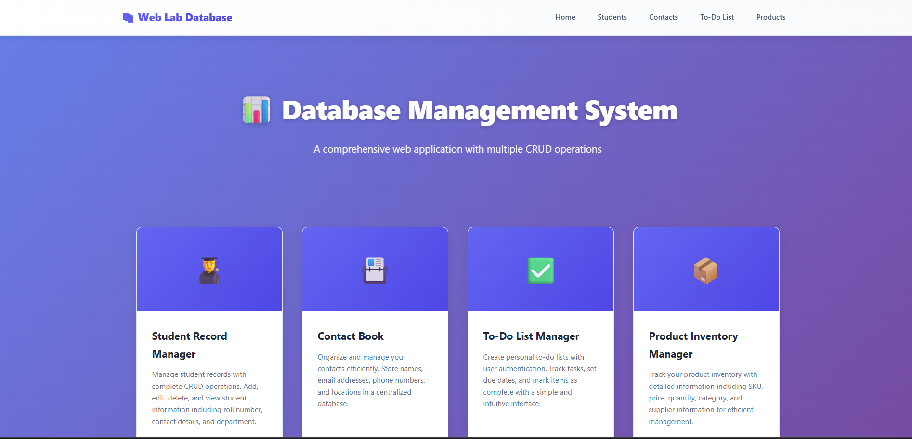
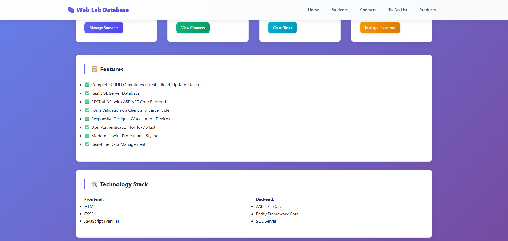
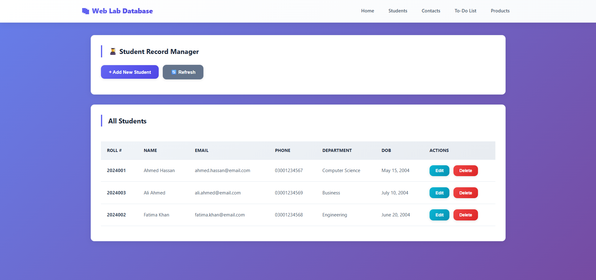
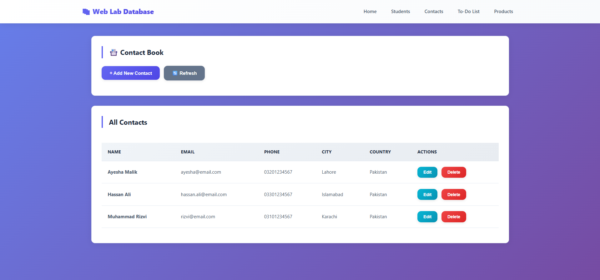
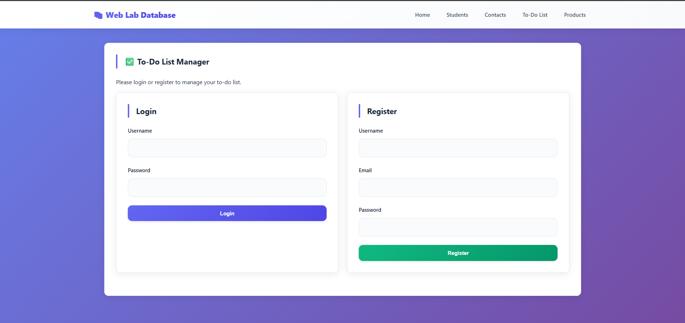
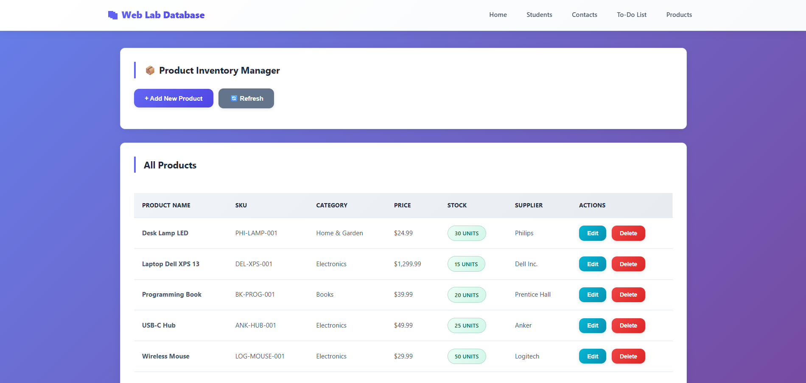
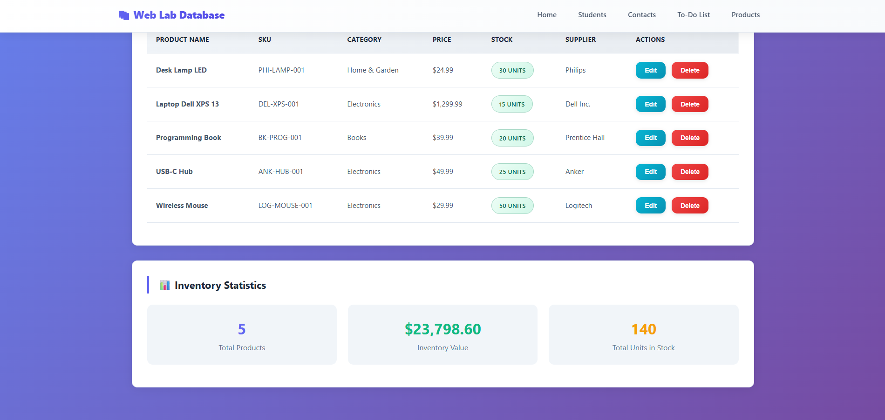

# Web Lab Database Assignment

A comprehensive full-stack web application demonstrating CRUD operations with **ASP.NET Core** backend, **SQL Server** database, and responsive **HTML/CSS/JavaScript** frontend.

## 📋 Overview

This project includes **4 complete database applications**:

1. **Student Record Manager** - Manage student information with complete CRUD operations
2. **Contact Book** - Organize and manage contacts
3. **To-Do List Manager** - Personal task management with user authentication
4. **Product Inventory Manager** - Track product inventory with real-time statistics

## ✨ Features

- ✅ Complete CRUD Operations (Create, Read, Update, Delete)
- ✅ Real SQL Server Database with Entity Framework Core
- ✅ RESTful API with ASP.NET Core Web API
- ✅ Responsive Frontend - Works on All Devices
- ✅ Form Validation (Client & Server-side)
- ✅ User Authentication for To-Do List
- ✅ Modern, Professional UI with Smooth Animations
- ✅ Real-time Data Management
- ✅ Error Handling & Notifications
- ✅ Database Statistics & Analytics

## 🛠️ Technology Stack

### Frontend
- **HTML5** - Semantic markup
- **CSS3** - Modern styling with gradients, flexbox, and grid
- **JavaScript** - Vanilla JS (no frameworks) with async/await
- **Fetch API** - For REST API communication

### Backend
- **ASP.NET Core 8.0** - Web API framework
- **Entity Framework Core 8.0** - ORM for database access
- **SQL Server** - Relational database

## 📁 Project Structure

```
WebLabDatabaseAssignment/
├── Backend/
│   ├── Models/
│   │   ├── Student.cs
│   │   ├── Contact.cs
│   │   ├── Todo.cs
│   │   └── Product.cs
│   ├── Controllers/
│   │   ├── StudentsController.cs
│   │   ├── ContactsController.cs
│   │   ├── UsersController.cs
│   │   ├── TodoItemsController.cs
│   │   └── ProductsController.cs
│   ├── Data/
│   │   └── AppDbContext.cs
│   ├── Program.cs
│   ├── appsettings.json
│   └── WebLabAPI.csproj
├── Frontend/
│   ├── css/
│   │   └── style.css
│   ├── js/
│   │   └── utils.js
│   ├── pages/
│   │   ├── student.html
│   │   ├── contact.html
│   │   ├── todo.html
│   │   └── product.html
│   └── index.html
├── Database/
│   └── DatabaseSetup.sql
└── README.md
```

## 🚀 Getting Started

### Prerequisites

- .NET 8.0 SDK ([Download](https://dotnet.microsoft.com/download/dotnet/8.0))
- SQL Server 2019 or LocalDB ([Download](https://www.microsoft.com/sql-server/sql-server-downloads))
- Visual Studio Code or Visual Studio 2022
- Git ([Download](https://git-scm.com))

### Step 1: Clone the Repository

```bash
git clone https://github.com/abdulrafayau/WebLabDatabaseAssignment.git
cd WebLabDatabaseAssignment
```

### Step 2: Setup SQL Server Database

**Option A: Using SQL Server Management Studio**

1. Open SQL Server Management Studio
2. Connect to your SQL Server instance
3. Open the file: `Database/DatabaseSetup.sql`
4. Execute the script to create the database and tables

**Option B: Using .NET EF Migrations** (if configured)

```bash
cd Backend
dotnet ef database update
```

### Step 3: Configure Backend

1. Update the connection string in `Backend/appsettings.json` if needed:

```json
{
  "ConnectionStrings": {
    "DefaultConnection": "Server=(localdb)\\mssqllocaldb;Database=WebLabDB;Trusted_Connection=true;TrustServerCertificate=true;"
  }
}
```

2. Restore dependencies:

```bash
cd Backend
dotnet restore
```

### Step 4: Run Backend API

```bash
dotnet run
```

The API will start at `https://localhost:7001`

### Step 5: Open Frontend

1. Navigate to `Frontend/index.html`
2. Open it in your browser (right-click → "Open with Live Server" if using VS Code)

**OR** use a simple HTTP server:

```bash
# Python 3
python -m http.server 8000

# Node.js (http-server)
npx http-server
```

Then open `http://localhost:8000/Frontend/index.html`

## 🔑 Default Login Credentials (For Testing)

To use the To-Do List, you need to register first:

1. Go to the **To-Do List** page
2. Click the **Register** tab
3. Enter credentials and register
4. Login with your credentials

## 📱 API Endpoints

### Students
- `GET /api/students` - Get all students
- `GET /api/students/{id}` - Get student by ID
- `POST /api/students` - Create student
- `PUT /api/students/{id}` - Update student
- `DELETE /api/students/{id}` - Delete student

### Contacts
- `GET /api/contacts` - Get all contacts
- `GET /api/contacts/{id}` - Get contact by ID
- `POST /api/contacts` - Create contact
- `PUT /api/contacts/{id}` - Update contact
- `DELETE /api/contacts/{id}` - Delete contact

### Users (Auth)
- `POST /api/users/register` - Register new user
- `POST /api/users/login` - User login
- `GET /api/users/{id}` - Get user with todos

### To-Do Items
- `GET /api/todoitems/user/{userId}` - Get user's todos
- `GET /api/todoitems/{id}` - Get todo by ID
- `POST /api/todoitems` - Create todo
- `PUT /api/todoitems/{id}` - Update todo
- `DELETE /api/todoitems/{id}` - Delete todo

### Products
- `GET /api/products` - Get all products
- `GET /api/products/{id}` - Get product by ID
- `POST /api/products` - Create product
- `PUT /api/products/{id}` - Update product
- `DELETE /api/products/{id}` - Delete product

## 🖼️ Screenshots

### Home Page









## 📋 Database Schema

### Students Table
| Column | Type | Constraint |
|--------|------|-----------|
| Id | INT | PK, Identity |
| RollNumber | NVARCHAR(50) | NOT NULL, UNIQUE |
| FirstName | NVARCHAR(100) | NOT NULL |
| LastName | NVARCHAR(100) | NOT NULL |
| Email | NVARCHAR(255) | NOT NULL, UNIQUE |
| PhoneNumber | NVARCHAR(20) | Nullable |
| DateOfBirth | DATETIME2 | Nullable |
| Department | NVARCHAR(100) | Nullable |
| CreatedAt | DATETIME2 | NOT NULL |
| UpdatedAt | DATETIME2 | Nullable |

### Contacts Table
| Column | Type | Constraint |
|--------|------|-----------|
| Id | INT | PK, Identity |
| FirstName | NVARCHAR(100) | NOT NULL |
| LastName | NVARCHAR(100) | NOT NULL |
| Email | NVARCHAR(255) | NOT NULL, UNIQUE |
| PhoneNumber | NVARCHAR(20) | Nullable |
| Address | NVARCHAR(500) | Nullable |
| City | NVARCHAR(100) | Nullable |
| Country | NVARCHAR(100) | Nullable |
| CreatedAt | DATETIME2 | NOT NULL |
| UpdatedAt | DATETIME2 | Nullable |

### Users Table
| Column | Type | Constraint |
|--------|------|-----------|
| Id | INT | PK, Identity |
| Username | NVARCHAR(100) | NOT NULL, UNIQUE |
| Email | NVARCHAR(255) | NOT NULL, UNIQUE |
| PasswordHash | NVARCHAR(MAX) | NOT NULL |
| CreatedAt | DATETIME2 | NOT NULL |

### TodoItems Table
| Column | Type | Constraint |
|--------|------|-----------|
| Id | INT | PK, Identity |
| UserId | INT | FK, NOT NULL |
| Title | NVARCHAR(255) | NOT NULL |
| Description | NVARCHAR(MAX) | Nullable |
| IsCompleted | BIT | NOT NULL |
| DueDate | DATETIME2 | NOT NULL |
| CreatedAt | DATETIME2 | NOT NULL |
| UpdatedAt | DATETIME2 | Nullable |

### Products Table
| Column | Type | Constraint |
|--------|------|-----------|
| Id | INT | PK, Identity |
| ProductName | NVARCHAR(255) | NOT NULL |
| Sku | NVARCHAR(100) | NOT NULL, UNIQUE |
| Description | NVARCHAR(MAX) | Nullable |
| Price | DECIMAL(10,2) | NOT NULL |
| QuantityInStock | INT | NOT NULL |
| Category | NVARCHAR(100) | Nullable |
| Supplier | NVARCHAR(255) | Nullable |
| CreatedAt | DATETIME2 | NOT NULL |
| UpdatedAt | DATETIME2 | Nullable |

## ✅ CRUD Operations Implemented

### Student Record Manager
- **C**reate: Add new students with form validation
- **R**ead: Display all students in table, view individual student details
- **U**pdate: Edit student information
- **D**elete: Remove student from database

### Contact Book
- **C**reate: Add new contacts
- **R**ead: Display all contacts with search capability
- **U**pdate: Modify contact information
- **D**elete: Remove contacts

### To-Do List Manager
- **C**reate: Add new tasks (requires login)
- **R**ead: Display pending and completed tasks
- **U**pdate: Edit task details and mark as complete
- **D**elete: Remove tasks

### Product Inventory Manager
- **C**reate: Add new products
- **R**ead: Display inventory with statistics
- **U**pdate: Modify product details and stock
- **D**elete: Remove products

## 🔒 Form Validation

All forms include validation:

**Client-side:**
- Required field validation
- Email format validation
- Phone number format validation
- Number range validation
- Date validation

**Server-side:**
- Model validation
- Unique constraint checks
- Business logic validation

## 📊 Error Handling

- Comprehensive error messages
- Try-catch blocks in all API calls
- User-friendly notifications
- Server-side exception handling
- Validation feedback

## 🎨 UI/UX Features

- **Responsive Design** - Mobile, tablet, and desktop optimized
- **Modern Styling** - Gradient backgrounds, smooth transitions
- **Intuitive Navigation** - Easy menu structure
- **Loading Indicators** - Visual feedback during operations
- **Modals** - Clean form interfaces
- **Tables** - Sortable and readable data display
- **Badges** - Visual indicators for status
- **Notifications** - Toast-style alerts for actions

## 🐛 Troubleshooting

### Backend won't start
1. Verify .NET 8.0 SDK is installed: `dotnet --version`
2. Check SQL Server is running
3. Verify connection string in `appsettings.json`
4. Clear .bin and obj folders: `dotnet clean`

### Database connection error
1. Confirm SQL Server instance is running
2. Verify connection string matches your setup
3. Check SQL Server authentication settings
4. Run: `sqlcmd -S (localdb)\mssqllocaldb -L` to verify LocalDB

### CORS errors in frontend
1. Verify backend is running on `https://localhost:7001`
2. Check CORS policy in `Program.cs`
3. Clear browser cache
4. Check browser console for specific errors

### API calls not working
1. Open browser DevTools (F12)
2. Check Network tab for request details
3. Verify API URL matches backend URL
4. Check for typos in endpoint paths

## 📝 Coding Standards

- Follows ASP.NET Core conventions
- RESTful API design
- Async/await for better performance
- Entity Framework best practices
- Semantic HTML5
- Responsive CSS3 with mobile-first approach
- Clean JavaScript with comments

## 🤝 Contributing

This is an academic assignment. For modifications:

1. Create a new branch: `git checkout -b feature/your-feature`
2. Commit changes: `git commit -am 'Add feature'`
3. Push to branch: `git push origin feature/your-feature`
4. Create Pull Request

## 📄 License

This project is for educational purposes only.

## 👨‍💻 Author

Created as part of CLO-01 Database Assignment

## 📞 Support

For issues or questions:
1. Check the Troubleshooting section
2. Review the API endpoints documentation
3. Check browser console for error messages
4. Verify all prerequisites are installed

## 🎓 Learning Outcomes

By completing this project, you will learn:

- ✅ How to build a full-stack web application
- ✅ ASP.NET Core Web API development
- ✅ Entity Framework Core ORM usage
- ✅ SQL Server database design
- ✅ RESTful API principles
- ✅ Frontend-backend integration
- ✅ Form validation techniques
- ✅ User authentication basics
- ✅ Responsive web design
- ✅ Git version control

## 📈 Future Enhancements

Potential improvements for this project:

- [ ] Add JWT authentication
- [ ] Implement pagination
- [ ] Add search/filter functionality
- [ ] Export data to CSV/PDF
- [ ] Real-time notifications
- [ ] Advanced analytics dashboards
- [ ] Unit and integration tests
- [ ] Docker containerization
- [ ] Azure deployment
- [ ] Mobile app version

---

**Status:** ✅ Complete and Tested

**Last Updated:** May 2024

**Repository:** [GitHub Link](https://github.com/abdulrafayau/WebLabDatabaseAssignment)
